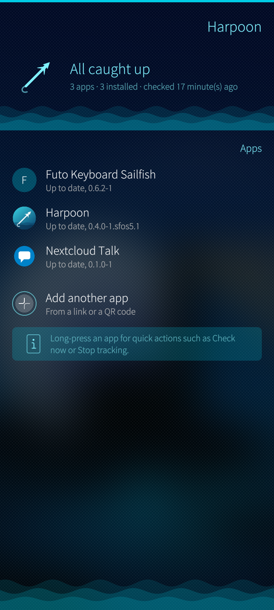
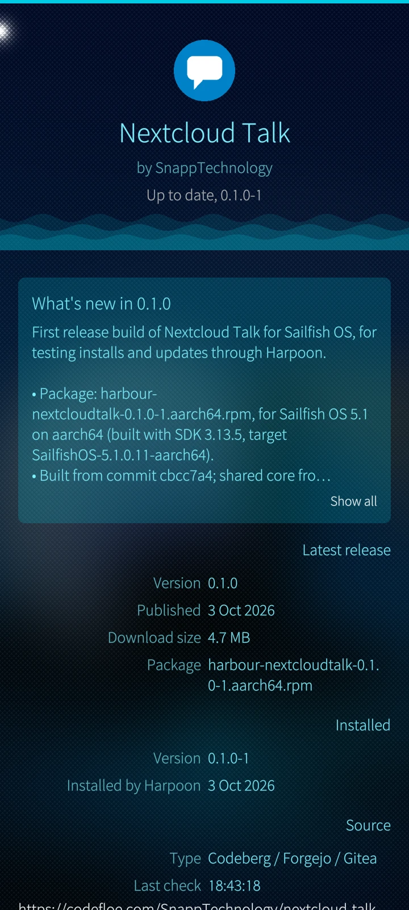
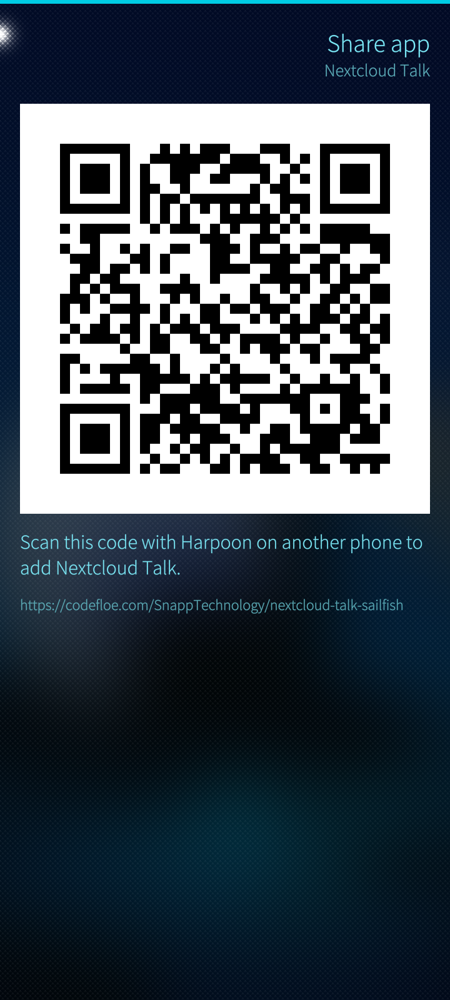

# Harpoon

**Get Sailfish OS apps straight from their developers, and keep them up to date.**

Many of the best Sailfish OS apps are published by their developers on GitHub, Codeberg
and other code-hosting sites, outside the Jolla Store. Harpoon keeps track of them for
you: it tells you when a new version is out and installs it with one tap.

<table>
  <tr>
    <td></td>
    <td></td>
    <td></td>
  </tr>
  <tr>
    <td align="center">Your apps at a glance</td>
    <td align="center">What's new, before you update</td>
    <td align="center">Share an app as a QR code</td>
  </tr>
</table>

## Why Harpoon

- **No more checking release pages.** Add an app once; Harpoon checks for new releases in
  the background and notifies you. Updates install with one tap, or automatically if you
  like.
- **Straight from the source.** Harpoon downloads the developer's own package from where
  they publish it. No middleman, no waiting for anyone to repackage it.
- **The right package for your phone.** Releases often contain packages for several phones
  and Sailfish versions. Harpoon picks the one that fits yours.
- **Careful by default.** Harpoon reads every package before installing it, never quietly
  downgrades an app or replaces a package that came from somewhere else, and can check that
  a package was really built by the app's own repository (signed build provenance).
- **Easy to add, easy to share.** Paste a link, tap a shortcut for GitHub, Codeberg or
  Codefloe, or scan a QR code. Any app you track can be shown as a QR code for a friend.
- **Private.** There is no Harpoon server and no account. Harpoon talks only to the sites
  the apps are published on.

It works with GitHub, Codeberg, Codefloe and other Forgejo or Gitea servers, GitLab,
SourceHut, SourceForge, Jenkins, plain web pages, direct `.rpm` links and RPM repositories.

## How it works

1. **Add an app.** Pull down on the list and choose **Add app**. Type or paste the address of
   the app's repository, tap a shortcut such as **github.com**, or scan the QR code from the
   app's web page. If an address has a typo, the form stays filled in so you only fix the
   mistake.
2. **Harpoon finds the latest release** with a package for your phone and shows what is new,
   the version, the download size and the package it will install.
3. **Install or update with one tap.** Harpoon downloads the package, checks it, and installs
   it through the system's package manager. Already installed some other way? Harpoon notices
   and simply keeps it up to date.
4. **Stay up to date.** Background checks run every few hours, even when Harpoon is closed.
   The list and the cover show what needs attention, and a notification tells you about new
   releases. You can let Harpoon install updates automatically, and exclude any app from
   that.

Long-press an app for quick actions, and pull down on an app's page to check it now, share
it as a QR code, change its settings or uninstall it. If an app moves, for example from
GitHub to Codeberg, change its address in its settings: everything else stays as it was.

## Installing
Harpoon needs SailfishOS 5.0 or later. It is not in the Jolla Store, which does not allow
apps that install other apps.

1. In **Settings → Untrusted software**, allow untrusted software.
2. On the phone, open the [latest release](https://github.com/JuhaniLehtimaeki/Harpoon/releases/latest)
   and download the package for your system:

   | SailfishOS (Settings → About product) | Package |
   |---|---|
   | 5.1 or later | `harpoon-…sfos5.1.aarch64.rpm` |
   | 5.0 | `harpoon-…sfos5.0.aarch64.rpm` |

   `aarch64` fits most phones (Xperia 10 II and newer, Jolla C2). Older 32-bit phones need
   `armv7hl`, and Intel tablets and the emulator need `i486`. In a terminal, `uname -m` tells
   (`armv7l` means `armv7hl`).
3. Open the download (from the browser's downloads, or **Settings → Transfers**) and confirm
   the installation. From a terminal: `devel-su pkcon install-local harpoon-*.rpm`.
4. Open Harpoon. It puts itself on the list, recognises itself as installed and from then on
   updates itself, picking the right package for the phone. (Versions before 0.5.0 do not
   do this: add `https://github.com/JuhaniLehtimaeki/Harpoon` with **Add app**, or scan the
   code below with **Scan QR code**.)

   

For the strictest check of Harpoon's own updates, set the app's **Check build provenance**
to "Refuse unless verified", the workflow to `release.yml` and the refs to `refs/tags/.*`:
every release package is signed by this repository's release workflow.

**Get updates from one place only.** Harpoon installed this way updates itself. If you
later install it from another repository (such as SailfishOS:Chum), stop tracking it in
Harpoon, so that two sources do not replace each other's package.

## For Sailfish OS app developers

**If you already publish your app as RPM packages in your releases on GitHub, Codeberg,
GitLab or another supported site, there is nothing to do.** Harpoon users can install and
update your app today. There is no store, submission, review or account involved: Harpoon
reads your releases the way a person would.

To make it even easier for people:

- **Add a QR code to your README** so people add your app in one scan. For a repository on a
  well-known site, the code simply contains the repository address:

  ```sh
  qrencode -o add-to-harpoon.png -s 8 -m 2 "https://github.com/you/harbour-yourapp"
  ```

  ```markdown
  [](https://github.com/JuhaniLehtimaeki/Harpoon)
  ```

  For a self-hosted server, a Jenkins job or an RPM repository, use a `harpoon://add` link
  instead. [docs/add-to-harpoon.md](docs/add-to-harpoon.md) explains both.
- **Keep Releases turned on.** On Codeberg and other Forgejo or Gitea servers, Releases can
  be switched off in the repository's settings (Settings, Units). Then there is nothing for
  Harpoon to find, even if your code and tags are there. People can still add your app:
  Harpoon shows it as waiting for builds, explains why, and offers it as soon as you
  publish a release with packages.
- **Use standard package file names**, `name-version-release.arch.rpm`, and attach a package
  for every architecture you support (`aarch64`, `armv7hl`, `i486`, or `noarch`). If you
  build separately for different Sailfish OS versions, put a tag such as `sfos5.1` in the
  file names; Harpoon picks the newest one that is not newer than the phone.
- **Keep the package name the same** from release to release, and tag each release with its
  version. Mark test builds as prereleases: Harpoon only offers them to people who opt in.
- **Write release notes.** Harpoon shows them, Markdown and links included, before people
  update.
- **Optional: sign your builds.** On GitHub, add
  [`actions/attest-build-provenance`](https://github.com/actions/attest-build-provenance) to
  your release workflow. Users can then have Harpoon refuse any package your repository did
  not build. Harpoon's own [release workflow](.github/workflows/release.yml) is an example.

## Developing Harpoon

Design notes: [docs/architecture.md](docs/architecture.md). Release process:
[docs/packaging.md](docs/packaging.md). Background research: [docs/research](docs/research).

### Using harpoon-cli (on the phone)
```sh
harpoon-cli add https://github.com/owner/repo      # track an app (or a harpoon://add link)
harpoon-cli list                                    # installed vs latest
harpoon-cli check                                   # check all apps for updates
sg privileged -c 'harpoon-cli install <app>'       # install; needs the privileged group
sg privileged -c 'harpoon-cli upgrade'             # install every available update
harpoon-cli background on --hours 6                 # periodic checks with notifications
harpoon-cli auto-update on                          # let those checks install updates too
harpoon-cli link https://git.example.org/me/app --source Forgejo   # a harpoon:// link for a QR code
harpoon-cli export ~/Documents/harpoon.json         # backup (import with: harpoon-cli import FILE)
```
Supported sources: GitHub, Codeberg/Forgejo/Gitea, GitLab, SourceHut, SourceForge, Jenkins,
plain web pages, direct `.rpm` links and rpm-md repositories. See [docs/sources.md](docs/sources.md).
Run `harpoon-cli --help` for all commands.

### Building the core on desktop Linux
The core needs Qt 5 (Core, Network, DBus, Test) and CMake. With Qt Quick installed
(`qtdeclarative5-dev`), the QML smoke test also runs. The tests also use `rpm`,
`rpmbuild` and `dbus-daemon` when they are available. The phone ships Qt 5.6, so the core
code must use only Qt 5.6 APIs, even though desktop builds use newer Qt.

```sh
sudo apt install qtbase5-dev qtdeclarative5-dev qml-module-qtquick2 cmake g++ rpm dbus zlib1g-dev libssl-dev   # Debian/Ubuntu
cmake -S . -B build
cmake --build build -j
ctest --test-dir build --output-on-failure
```

### Building for SailfishOS
```sh
sfdk build      # uses rpm/harpoon.spec; builds the app (harpoon), harpoon-cli and harpoon-autoupdate
```
Releases and publishing on SailfishOS:Chum: [docs/packaging.md](docs/packaging.md).

### Trying a real repository
```sh
./build/tools/harpoon-probe/harpoon-probe https://github.com/sailfishos-chum/sailfishos-chum-gui --arch aarch64 --sfos 5.0.0.62
./build/tools/harpoon-probe/harpoon-probe https://git.example.net/me/app --source Forgejo
```
Set `HARPOON_TOKEN` to pass an API token for the matched forge. Options:
- `--prereleases` includes prereleases.
- `--track-only` drops the need for an installable asset.
- `--set key=value` sets any per-app setting (see `core/src/model/appsettings.h`).

## Licence
GPL-3.0-or-later, see [LICENSE](LICENSE). Parts of the core are ported from
[ObtainX](https://github.com/bikram-agarwal/ObtainX) (GPL-3.0). QR codes use the bundled
[zxing-cpp](https://github.com/zxing-cpp/zxing-cpp) (Apache-2.0, `3rdparty/zxing-cpp`).
